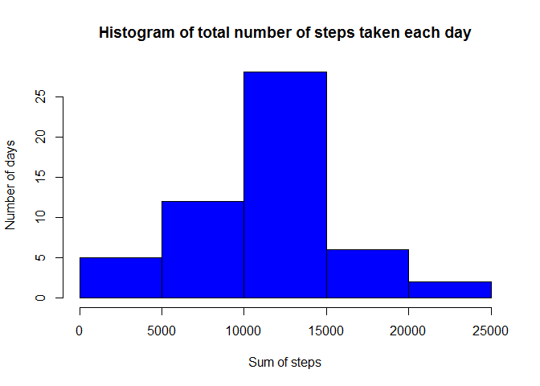
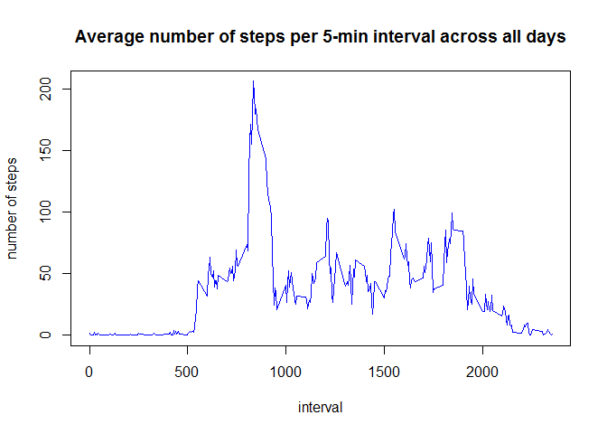

# Reproducible Research: Peer Assessment 1

Activity monitoring data assignment
===================================

First we are going to load the data previously downloaded from the github repo (https://github.com/rdpeng/RepData_PeerAssessment1) into the working directory. 


```r
data <- read.csv("activity.csv")
```


###What is mean total number of steps taken per day?

In order to calculate the total number of steps taken per day we need first to create a new dataframe where we sum the number of steps from the original data frame by date. 


```r
require(data.table)
```

```
## Loading required package: data.table
```

```r
dt<-data.table(data)[,sum(steps),by=date]
```


Here's a histogram of the total number of steps taken each day:

```r
hist(dt$V1,xlab='Sum of steps',ylab='Number of days',main='Histogram of total number of steps taken each day',col='blue')
```

 


We calculate the mean and median of the total number of steps taken per day:

```r
mean(dt[,dt$V1],na.rm=TRUE)
```

```
## [1] 10766.19
```

```r
median(dt[,dt$V1],na.rm=TRUE)
```

```
## [1] 10765
```


###What is the average daily activity pattern?

Here's a time series plot of the 5-minute interval (x-axis) and the average number of steps taken, averaged across all days (y-axis). As you can see below, we first remove the NA values.


```r
data2 <- na.omit(data)
dt2<-data.table(data2)[,mean(steps),by=interval]
plot(dt2,type="l",main='Average number of steps per 5-min interval across all days',ylab='number of steps',col='blue')
```

 


I'm also calculating which interval is on average the one that contains the maximum number of steps: 835

```r
dt2[dt2$V1==max(dt2$V1)]
```

```
##    interval       V1
## 1:      835 206.1698
```


###Imputing missing values

We are going to calculate first how many missing values (coded as NA) we have in the data frame: 2304


```r
sum(is.na(data))
```

```
## [1] 2304
```


In order to impust these missing values, we decided to fill in all of those values with the mean of that 5-minute interval. To that end, we take the means already calculated in the dt2 data frame and insert them into a new dataset (data3). 


```r
data3 <- data

for (i in 1:nrow(data3)) 
        if (is.na(data3[i,"steps"])) {
                interval_day <- data3[i,"interval"]
                data3[i,"steps"]<-dt2[dt2$interval==interval_day,V1]
        }
```


Then we calculate the total number of steps taken each day by using the data from data3 and save it into dt3:


```r
dt3<-data.table(data3)[,sum(steps),by=date]
```


Next, we make a histogram of this new total number of steps taken each day from the data in dt3:


```r
hist(dt3$V1,xlab='Sum of steps',ylab='Number of days',main='Histogram of total number of steps taken each day',col='blue')
```

 


By taking the mean and median, we see that the values differ very little from what we calculated above. The mean is still the same (just because we filled in the missing values using the mean per interval), whereas the median has only been altered from 10765 to 10766.19. Therefore we can consider that the impact of imputing missing data didn't impact negatively the estimates of the total daily number of steps. Actually, if you compare the 2 histograms you can see that the distribution is fairly identical, and the only difference is that more days are included into the 2nd histogram simply because there's more data points.


```r
mean(dt3[,dt3$V1])
```

```
## [1] 10766.19
```

```r
median(dt3[,dt3$V1])
```

```
## [1] 10766.19
```


###Are there differences in activity patterns between weekdays and weekends?

Taking the previous dataset with the filled-in missing values, we are going to replace the dates with the day of the week so we can distinguish between weekdays and weekends:


```r
data4 <- data3
data4[,"date"] <- weekdays(as.Date(data4[,"date"]))
data4[data4[,"date"] =="Saturday" | data4[,"date"] == "Sunday","date"] <- "weekend"
data4[data4[,"date"] != "weekend" ,"date"] <- "weekday"
```


Now we want to create a new dataframe with the sum of steps per day, differentiating between weekday or weekend. 


```r
dt4<-data.table(data4)[,sum(steps),by=c("interval","date")]
```


Before doing a panel plot we want to check what the maximum values are in both cases, so we can set the same ylab limit values (otherwise it's not easy to compare the two plots):


```r
weekday <- subset(dt4,date=="weekday")
weekend <- subset(dt4,date=="weekend")
summary(weekday)
```

```
##     interval          date                 V1         
##  Min.   :   0.0   Length:288         Min.   :    0.0  
##  1st Qu.: 588.8   Class :character   1st Qu.:  101.1  
##  Median :1177.5   Mode  :character   Median : 1161.1  
##  Mean   :1177.5                      Mean   : 1602.5  
##  3rd Qu.:1766.2                      3rd Qu.: 2288.4  
##  Max.   :2355.0                      Max.   :10367.0
```

```r
summary(weekend)
```

```
##     interval          date                 V1         
##  Min.   :   0.0   Length:288         Min.   :   0.00  
##  1st Qu.: 588.8   Class :character   1st Qu.:  19.86  
##  Median :1177.5   Mode  :character   Median : 517.43  
##  Mean   :1177.5                      Mean   : 677.86  
##  3rd Qu.:1766.2                      3rd Qu.:1194.46  
##  Max.   :2355.0                      Max.   :2666.23
```


Now that we found that the maximum value is higher than 10,000 steps, we can make a panel plot containing a time series plot of the 5-minutes interval (x-axis) and the average number of steps taken, averaged across all weekday days or weekend days (y-axis). Note that both y-axis use the same limits.


```r
par(mfrow = c(2,1),oma = c(5,4,0,0),mar = c(0,0,2,2)+2)
plot(subset(dt4,date=="weekday",select=c(interval,V1)),type="l",main="Average number of steps per 5-min interval\n\nWeekday",ylim=c(0,10500),xlab="",col='blue',ylab="number of steps")
plot(subset(dt4,date=="weekend",select=c(interval,V1)),type="l",main="Weekend",ylim=c(0,10500),col='blue',ylab="number of steps")
title(main='Average number of steps per 5-min interval',xlab='interval',ylab='number of steps',outer=TRUE,line=1)
```

 


By comparing both plots we can easily determine that this individual is much more active during the week (from Monday to Friday) than during the weekend. 
